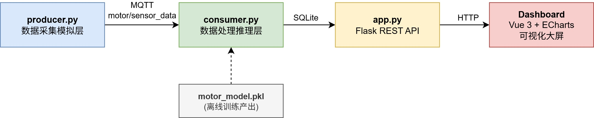
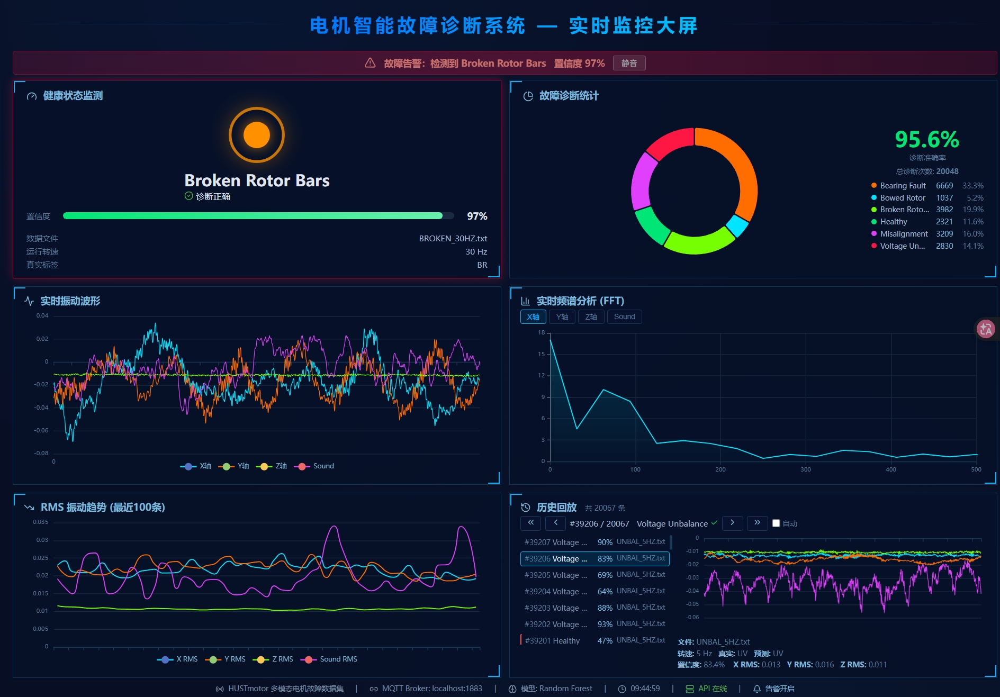

# 电机智能故障诊断系统

  
  
  
  

基于多模态信号（振动 + 声学）与机器学习的电机智能故障诊断系统。利用 HUSTmotor 公开数据集，构建完整覆盖"数据采集 → 数据传输 → 数据处理 → 数据应用"全链路的工业互联网原型系统。

> - **快速开始** 请先阅读 [快速开始.md](快速开始.md)，从零搭建运行环境。
>
> - **技术设计** 请参阅 [项目框架.md](项目框架.md)，了解架构设计与实现细节。
>
> - **数据集** 请参考 [数据集说明.md](数据集说明.md)，了解数据来源与格式。

## 项目概要

- **数据集**：HUSTmotor 多模态电机故障数据集，24 个文件，163,840 采样点/文件
- **传感器**：三轴振动加速度计（X/Y/Z）+ 麦克风（Sound），采样率 25.6 kHz
- **故障类型**：6 类 — 健康(H)、轴承故障(BF)、弯曲转子(BOW)、转子断条(BR)、不对中(MIS)、电压不平衡(UV)
- **转速工况**：4 种 — 5 Hz、10 Hz、20 Hz、30 Hz
- **核心算法**：Random Forest（200 棵树，max_depth=12），70 维无量纲特征 + 动态谐波提取
- **最终准确率**：测试集 98.43%，Kappa 0.9811

## 系统架构

两条流水线通过模型文件衔接，各自独立运行：

| 流水线 | 名称 | 频率 | 核心流程 |
|--------|------|------|---------|
| **流水线一** | 离线模型训练 | 一次性 | 数据加载 → 3σ清洗 → 滑动窗口 → 70维特征 → 分层8:2划分 → RF训练 → 评估 → 保存 |
| **流水线二** | 在线实时推理 | 持续运行 | MQTT接收 → 特征提取 → 模型推理 → SQLite存储 → Flask API → 大屏展示 |

## 特征工程（70 维）

全部采用无量纲或归一化特征，对转速变化天然鲁棒。与流水线一/二共用的 `feature_utils.py` 实现。

| 特征类别 | 维度 | 核心指标 |
|---------|:---:|------|
| 无量纲时域 | 24 | 峭度、偏度、波峰因子(peak/rms)、波形因子(rms/abs_mean)、脉冲因子、裕度因子 ×4通道 |
| 频谱统计 | 24 | 频谱质心、散布、偏度、峭度、平坦度、85%能量滚降点 ×4通道 |
| 动态谐波 | 12 | 根据当前转速动态计算 fr，±3.5Hz 搜索窗提取 1×fr/2×fr/3×fr 归一化幅值 ×4通道 |
| 跨通道比值 | 9 | 6项 RMS 比值 + 3项 Peak 比值，捕获振动能量在传感器间的分布模式 |
| 转速 | 1 | 电机转频 fr（Hz） |
| **合计** | **70** | 零填充 FFT (n_fft=8192)，频率分辨率 ~3.1 Hz，可分辨 5–30 Hz 转频 |

## 可视化大屏

基于 Vue 3 + Vite 构建的单页应用，使用 ECharts 5 渲染所有图表，整体采用 2 列 × 3 行的网格布局。六个面板分别对应系统的六个维度：

| 面板 | 位置 | 功能 |
|------|------|------|
| 状态仪表盘 | 左上 | 当前最新诊断结果：交通灯状态指示 + 置信度进度条 + 故障告警（浏览器通知 + 视觉闪烁） |
| 故障统计饼图 | 右上 | 累计类别分布 + 诊断准确率 + 分类明细 |
| 实时波形图 | 中左 | 四通道 1024 点振动波形同步绘制 |
| 实时频谱图 | 中右 | 四通道 FFT 频域特征 + 转频谐波标记线（1×fr / 2×fr / 3×fr） |
| RMS 趋势图 | 下左 | 最近 100 条四通道振动能量演化 + dataZoom 滚轮缩放 |
| 历史回放 | 下右 | 分页记录列表 + 点击加载波形预览 + 自动播放模式 |

大屏采用独立轮询方式获取数据。六个面板各自拥有独立的 `setInterval` 定时器和 try-catch 错误处理，刷新频率差异化设置：

| 刷新频率 | 面板 | 原因 |
|---------|------|------|
| **1 秒** | 状态仪表盘、波形图、频谱图 | 反映"当前这一帧"的瞬时状态 |
| **3 秒** | RMS 趋势图 | 趋势需要积累一定量数据才有意义 |
| **5 秒** | 故障统计饼图、历史回放 | 累计指标，变化相对缓慢 |

频率分流设计避免了所有接口以相同节奏请求造成的瞬时负载尖峰。

## REST API

| 端点 | 方法 | 说明 |
|------|------|------|
| `/api/latest` | GET | 最新预测结果（标签 + 置信度 + 正确性） |
| `/api/trend?n=100` | GET | 最近 N 条 RMS 趋势数据 |
| `/api/statistics` | GET | 故障分布统计 + 累计准确率 |
| `/api/waveform` | GET | 最新四通道波形（1024 点 × 4） |
| `/api/spectrum?channel=x` | GET | 四通道频谱（支持单通道筛选） |
| `/api/history/<id>` | GET | 指定 ID 历史记录详情（含完整波形） |
| `/api/records?page=1&limit=50` | GET | 分页查询记录列表（支持 `?label=BF` 筛选） |
| `/api/health` | GET | 健康检查 + 数据库记录总数 |

## 技术栈

| 层级 | 技术 |
|------|------|
| 数据处理 | Python, NumPy, Pandas, SciPy |
| 机器学习 | Scikit-learn (Random Forest 200树) |
| 消息中间件 | EMQX 5.3.2 (MQTT Broker), paho-mqtt |
| 后端 API | Flask + flask-cors（8 个 REST 端点） |
| 数据库 | SQLite (WAL 模式，自动清理 >20,000 条) |
| 前端框架 | Vue 3 + Vite + ECharts 5 |
| 日志系统 | Python logging + RotatingFileHandler（10MB 轮转） |
| 评估图表 | Matplotlib + Seaborn |
| 实验记录 | Jupyter Notebook × 3 |

## License

本项目仅用于学术研究与教学演示。数据集引用信息见 [数据集说明.md](数据集说明.md)。
