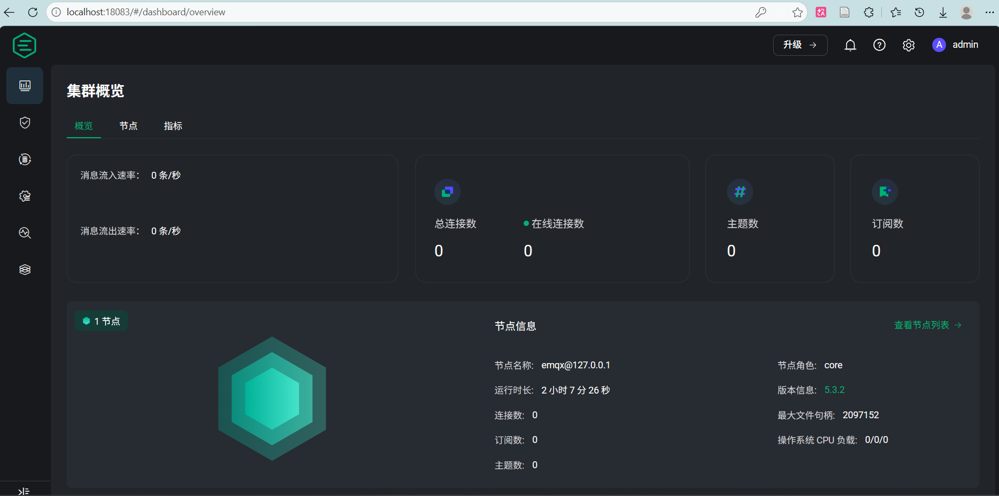

# 电机智能故障诊断系统 — 快速开始指南

> 本文档是**操作手册**，手把手带你从零搭建并运行整个系统。
> 想了解系统架构、特征设计、API 文档等，请参阅 [README.md](README.md)；技术设计细节见 [项目框架.md](项目框架.md)。

## 一、环境要求

| 依赖 | 版本 | 说明 |
|------|------|------|
| Python | 3.8+ | 数据处理 + 机器学习 + Flask API |
| Node.js | 18+ | 可视化大屏 (Vue 3 + Vite) |
| EMQX | 5.3.2 (Windows) | MQTT 消息中间件 |

## 二、项目结构

```
motor_health_project/
├── data/                        # 原始数据集 (24个txt文件)
├── src/
│   ├── config.py                # 全局配置参数
│   ├── feature_utils.py         # 特征提取函数 (70维，两流水线共用)
│   ├── train_model.py           # 流水线一：离线模型训练
│   ├── producer.py              # 流水线二：MQTT 数据模拟发送
│   ├── consumer.py              # 流水线二：MQTT 接收 + 推理 + 存储 + 日志
│   └── app.py                   # 流水线二：Flask REST API (8个端点)
├── dashboard/                   # 可视化大屏 (Vue 3 + ECharts 5)
│   └── src/
│       ├── App.vue              # 主布局 + 故障告警
│       └── components/          # 6个面板组件
├── img/                         # 流程图与演示截图
├── notebooks/                   # Jupyter Notebook 实验记录 ×3
├── models/                      # 训练好的模型文件
├── database/                    # SQLite 数据库 (运行时生成)
├── logs/                        # Consumer 日志 (运行时生成)
├── outputs/                     # 模型评估图表 ×7
├── requirements.txt             # Python 依赖
├── run_all.bat                  # Windows 一键启动脚本
├── README.md                    # 项目概览
├── 项目框架.md                   # 技术设计文档
└── 数据集说明.md                 # 数据集详细说明
```

## 三、一键安装

```bash
# 1. Python 虚拟环境 + 依赖
cd motor_health_project
python -m venv venv
venv\Scripts\activate          # Windows
# source venv/bin/activate     # macOS/Linux
pip install -r requirements.txt

# 2. 前端依赖
cd dashboard
npm install
cd ..
```

## 四、流水线一：离线模型训练

```bash
# 激活虚拟环境后，直接运行
venv\Scripts\python src\train_model.py
```

**执行内容**：数据加载 → 清洗 → 滑动窗口 → 特征提取 → 数据集划分 → 随机森林训练 → 评估 → 保存模型

**输出**：
| 文件 | 说明 |
|------|------|
| `models/motor_model.pkl` | 训练好的模型包 |
| `outputs/confusion_matrix.png` | 混淆矩阵 |
| `outputs/feature_importance.png` | 特征重要性排名 |
| `outputs/roc_curves.png` | ROC 曲线 |
| `outputs/learning_curve.png` | 学习曲线 |
| `outputs/classification_report.txt` | 分类报告 |

> **预期结果**：测试集准确率 >98%，训练时间约 36 秒。

## 五、流水线二：在线实时推理

流水线二需要 4 个终端同时运行。开始之前，必须先确保 EMQX 已启动。

---

### 5.0 启动 EMQX

EMQX 是整个系统的消息中枢，所有数据通过它转发。

#### Windows 启动方式

打开一个新的 **命令提示符（cmd）** ，进入 EMQX 的 bin 目录并启动：

```cmd
E:
cd .\emqx-5.3.2-windows-amd64\bin
.\emqx.cmd console
```

> **提示**：`console` 模式会在当前窗口显示 EMQX 运行日志，便于调试。按 `Ctrl+C` 可停止。
> 如果希望后台运行，使用 `.\emqx.cmd start`。

#### 验证 EMQX 是否启动成功

打开浏览器，访问以下地址：

```
http://localhost:18083
```

初次访问需要登录：
- **用户名**：`admin`
- **密码**：`123456`（默认，如改过则用你的密码）

登录后进入 Dashboard 首页，能看到节点状态、连接数、消息吞吐量等概览信息。

#### 查看 MQTT 订阅连接

浏览器访问以下地址，可以看到当前有哪些客户端订阅了哪些 Topic：

```
http://localhost:18083/#/subscriptions/subscription
```

当 consumer.py 启动后，这里会出现一条订阅记录：`motor/sensor_data`。

> **注意**：刚启动 EMQX 时这个页面是空的，属于正常现象——说明还没有客户端订阅。


### 5.1 启动后端服务（按顺序，需要 3 个终端）

整个数据流如下：


**每个终端都需要先激活 Python 虚拟环境：**
```bash
cd E:\你的路径\motor_health_project
venv\Scripts\activate
```

#### 终端 1：Flask API（最先启动）

```bash
venv\Scripts\python src\app.py --port 5000
```

看到以下输出说明启动成功：
```
 * Running on http://127.0.0.1:5000
```

> 如果端口被占用，换一个端口：`venv\Scripts\python src\app.py --port 5001`

#### 终端 2：Consumer（MQTT 消费者）

```bash
venv\Scripts\python src\consumer.py
```

看到 `[MQTT] 已连接 Broker` 和 `[MQTT] 已订阅 Topic: motor/sensor_data` 说明启动成功。

此时回到 EMQX Dashboard → 订阅管理页面（`http://localhost:18083/#/subscriptions/subscription`），你会看到一个新的订阅记录，Client ID 为 `motor_consumer`，订阅 Topic 为 `motor/sensor_data`。

#### 终端 3：Producer（MQTT 生产者）

```bash
# 单次发送全部 24 个文件（约 5 分钟），发完自动退出
venv\Scripts\python src\producer.py --no-loop

# 或：循环重放（持续模拟在线监测，不会自动停止）
venv\Scripts\python src\producer.py
```

启动后会逐文件处理并发送，每处理完一个文件会打印统计。此时：
- 终端 2（consumer）会不断打印推理日志：`[#00001] ✓ 真实=... 预测=... 置信度=0.962`
- EMQX Dashboard 首页的消息吞吐量曲线会上升

---

### 5.3 启动大屏前端（终端 4）

```bash
cd dashboard
npm run dev
```

浏览器打开 http://localhost:3000

大屏刷新频率：状态/波形/频谱 **1 秒**，RMS 趋势 **3 秒**，故障统计 **5 秒**。

---

### 5.4 完整启动检查清单

| 序号 | 做什么 | 怎么验证 |
|------|--------|---------|
| 1 | 启动 EMQX | 浏览器打开 http://localhost:18083，能登录 Dashboard 即可 |
| 2 | 终端1：`app.py` | `curl http://localhost:5000/api/health` 返回 `{"status":"ok"}` |
| 3 | 终端2：`consumer.py` | 看到 `[MQTT] 已订阅 Topic: motor/sensor_data` |
| 4 | 终端3：`producer.py` | 看到 `[Producer] 开始发送: BF_10HZ.txt...` |
| 5 | 终端4：`npm run dev` | 浏览器 http://localhost:3000 显示大屏，面板有数据 |

### 5.5 停止

按以下顺序停止（或直接全部 `Ctrl+C`）：

1. 终端4：大屏（Ctrl+C）
2. 终端3：Producer（Ctrl+C，或等 --no-loop 自动结束）
3. 终端2：Consumer（Ctrl+C）
4. 终端1：Flask API（Ctrl+C）
5. EMQX：在 EMQX 的 cmd 窗口中按 Ctrl+C

## 六、常见问题

### Q1：EMQX 启动失败

**现象**：`.\emqx.cmd console` 报错或闪退

**解决**：
1. 检查是否已经有一个 EMQX 在运行（不能同时开两个）
2. 查看 EMQX 的 `log` 目录下的日志文件
3. 确保端口 1883（MQTT）和 18083（Dashboard）没被占用
   ```cmd
   netstat -ano | findstr :1883
   netstat -ano | findstr :18083
   ```


### Q2：大屏显示"等待数据"

按 F12 查看浏览器控制台是否有红色报错。然后依次检查：
1. 终端1 Flask API 是否在运行：`curl http://localhost:5000/api/health`
2. 终端2 consumer 是否在运行：查看 consumer 终端是否有 `[MQTT] 已订阅` 日志
3. 终端3 producer 是否在发送：查看 producer 终端是否有 `开始发送` 日志
4. 浏览器是否打开了正确的地址：`http://localhost:3000`

### Q3：consumer.py 报错"模型文件不存在"

需要先运行流水线一生成模型：
```bash
venv\Scripts\python src\train_model.py
```

### Q4：consumer.py 报错 MQTT 连接失败

1. 确认 EMQX 已启动（步骤 5.0）
2. 确认 `src/config.py` 中 `MQTT_BROKER = "localhost"`，`MQTT_PORT = 1883`
3. 如果 EMQX 在其他机器上，修改 `MQTT_BROKER` 为对应 IP

### Q5：端口被占用

```bash
# Flask API 换端口
venv\Scripts\python src\app.py --port 5001

# 同步修改 dashboard/vite.config.js 中的 proxy.target 端口
```

### Q6：npm install 报错

1. 确认 Node.js 版本 >= 18：`node --version`
2. 清除缓存重试：`npm cache clean --force && npm install`
3. 如果用淘宝镜像：`npm install --registry=https://registry.npmmirror.com`

### Q7：想用 XGBoost 代替随机森林

编辑 `src/config.py`，将 `MODEL_TYPE = "rf"` 改为 `MODEL_TYPE = "xgb"`，重新运行流水线一。

### Q8：consumer 推理准确率很低

consumer 推理时使用的是和训练完全相同的特征提取函数，准确率理论上应和训练时一致（>98%）。如果偏低：
1. 确认 `models/motor_model.pkl` 是最新训练的（运行过流水线一）
2. 检查 MQTT 传输的波形数据是否完整（1024 点 × 4 通道）
3. 查看 consumer 日志中置信度是否偏低

