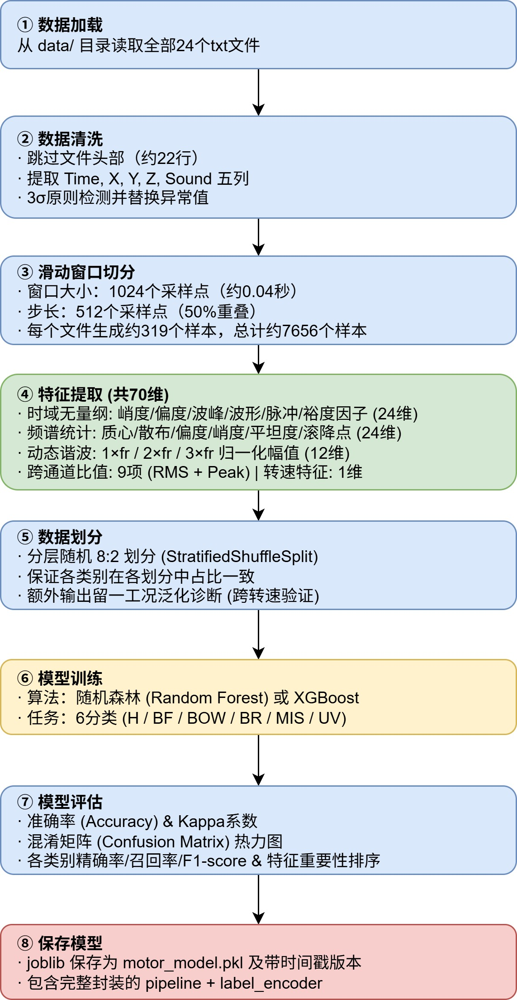
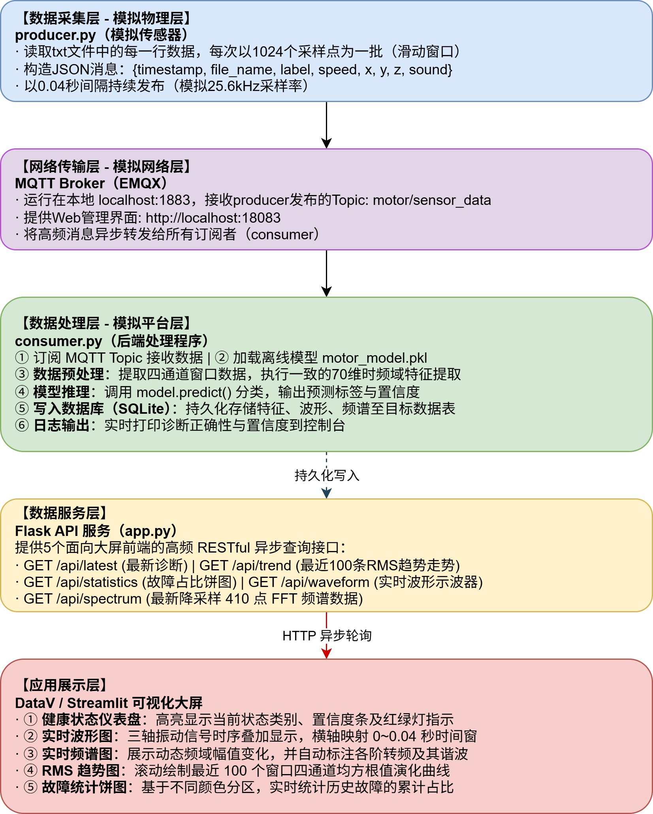

## 项目整体框架


## 一、项目概述

### 1.1 项目名称
**基于多模态信号与机器学习的电机智能故障诊断系统**

### 1.2 项目目标
利用HUSTmotor公开数据集，构建一套完整的电机故障诊断系统。系统通过"离线训练"获得故障分类模型，再通过"在线模拟"实现实时数据采集、传输、推理与可视化展示，完整覆盖工业互联网"数据采集→数据传输→数据处理→数据应用"全链路。

### 1.3 核心功能
| 序号 | 功能模块 | 功能描述 |
|------|---------|----------|
| 1 | 数据采集模拟 | 模拟工业传感器实时采集振动与声学信号 |
| 2 | 数据传输 | 通过MQTT协议实现数据从采集端到处理端的流转 |
| 3 | 数据清洗与特征提取 | 异常值处理、滑动窗口切分、时频域特征提取 |
| 4 | 故障诊断模型 | 基于随机森林/XGBoost的6种电机状态分类 |
| 5 | 实时推理 | 对模拟实时数据流进行在线故障判别 |
| 6 | 数据存储 | 推理结果与特征数据持久化存储 |
| 7 | 可视化大屏 | 实时波形、频谱、健康状态、故障统计展示 |


## 二、系统总体架构

整个项目由两条独立的流水线构成：

| 流水线 | 名称 | 执行频率 | 输入 | 输出 |
|--------|------|---------|------|------|
| **流水线一** | 离线模型训练 | 一次性执行 | 24个txt数据文件 | 训练好的分类模型（.pkl） |
| **流水线二** | 在线实时推理 | 循环持续运行 | txt文件逐行模拟发送 | 可视化大屏动态展示 |

两条流水线的衔接点：**流水线一产出的模型文件（model.pkl）被流水线二加载使用。**


## 三、流水线一：离线模型训练

### 3.1 流程图



### 3.2 各环节详细说明

#### ① 数据加载
- **数据来源**：`/data/` 目录下24个txt文件
- **命名规则**：`[状态]_[转速]HZ.txt`，如 `H_5HZ.txt`、`BF_10HZ.txt`
- **文件结构**：头部参数约22行 + 数据体（163,840行 × 5列）

#### ② 数据清洗
- **格式解析**：跳过表头，提取Time、X、Y、Z、Sound五列
- **异常值处理**：3σ原则——计算每个通道的均值和标准差，超出[μ-3σ, μ+3σ]的值替换为该通道中位数
- **标签提取**：从文件名提取状态标签（H/BF/BOW/BR/MIS/UV）和转速（5/10/20/30）

#### ③ 滑动窗口切分
- **窗口大小**：1024个采样点
- **步长**：512个采样点（50%重叠）
- **样本量估算**：每个文件约319个窗口（163840/512≈320），24个文件共约7,656个样本

#### ④ 特征提取

| 特征类型 | 具体特征 | 应用通道 | 数量 |
|---------|---------|---------|------|
| **时域无量纲** | 峭度（Kurtosis） | X/Y/Z/Sound | 4 |
| | 偏度（Skewness） | X/Y/Z/Sound | 4 |
| | 波峰因子（Crest Factor = peak/rms） | X/Y/Z/Sound | 4 |
| | 波形因子（Shape Factor = rms/mean_abs） | X/Y/Z/Sound | 4 |
| | 脉冲因子（Impulse Factor = peak/mean_abs） | X/Y/Z/Sound | 4 |
| | 裕度因子（Clearance Factor） | X/Y/Z/Sound | 4 |
| **频谱统计** | 频谱质心（Centroid） | X/Y/Z/Sound | 4 |
| | 频谱散布（Spread） | X/Y/Z/Sound | 4 |
| | 频谱偏度（Skewness） | X/Y/Z/Sound | 4 |
| | 频谱峭度（Kurtosis） | X/Y/Z/Sound | 4 |
| | 频谱平坦度（Flatness） | X/Y/Z/Sound | 4 |
| | 频谱滚降点（Rolloff, 85%能量） | X/Y/Z/Sound | 4 |
| **动态谐波** | 1×fr 归一化幅值 | X/Y/Z/Sound | 4 |
| | 2×fr 归一化幅值 | X/Y/Z/Sound | 4 |
| | 3×fr 归一化幅值 | X/Y/Z/Sound | 4 |
| **跨通道比值** | RMS比值（6项）+ Peak比值（3项） | — | 9 |
| **工况** | 转速频率 fr | — | 1 |
| **合计** | | | **70维** |

> 设计要点: 时域全部采用无量纲指标，通过比值运算消除振动幅值量级影响，对转速变化具有天然鲁棒性。频域根据当前转速动态计算转频 fr，以 ±3.5 Hz 搜索窗提取谐波幅值。采用零填充 FFT (n_fft=8192)，频率分辨率约 3.1 Hz。

#### ⑤ 数据划分策略

采用**分层随机 8:2 划分**（StratifiedShuffleSplit），训练集 80%，测试集 20%。保证各类别在各划分中占比一致，避免按转速划分导致的极端域偏移问题。

同时运行**留一工况泛化诊断**（Leave-One-Speed-Out CV）作为辅助指标，评估模型在未见过转速下的泛化性能。

#### ⑥ 模型训练

| 配置项 | 选择 |
|--------|------|
| 算法 | 随机森林（优先）/ XGBoost（可选） |
| 决策树数量 | 200 棵 |
| 最大深度 | 12（限制深度防止过拟合） |
| 叶节点最小样本数 | 5（正则化） |
| 任务类型 | 多分类（6类） |
| 评估指标 | 准确率、Kappa、ROC-AUC、混淆矩阵 |

#### ⑦ 模型评估

输出内容：
- 测试集准确率（目标>90%）、Kappa系数
- 混淆矩阵热力图，归一化混淆矩阵
- 每类故障的精确率/召回率/F1-score/AUC-ROC
- 特征重要性柱状图
- ROC曲线、分类报告可视化、学习曲线

#### 模型保存

保存为 `models/motor_model.pkl`（默认路径，供 consumer 加载）和带时间戳的版本副本 `models/motor_model_YYYYMMDD_HHMMSS.pkl`。consumer 启动时自动加载最新版本的模型文件。

**模型包内容**：`{"pipeline": ..., "label_encoder": ..., "feature_columns": [...], "train_date": ..., "test_accuracy": ...}`


## 四、流水线二：在线实时推理与展示

### 4.1 流程图


### 4.2 各环节详细说明

#### 数据采集（producer.py）
| 配置项 | 参数 |
|--------|------|
| 数据源 | /data/ 目录下的txt文件（逐个读取，循环发送） |
| 发送粒度 | 1024个采样点/批 |
| 发送间隔 | 0.04秒/批（模拟25.6kHz采样率） |
| 消息格式 | JSON（含波形数据+元数据） |
| 协议 | MQTT，发布到 `motor/sensor_data` |

#### 数据传输（EMQX Broker）
| 配置项 | 参数 |
|--------|------|
| Broker地址 | localhost:1883 |
| 部署方式 | Docker容器 |
| 管理界面 | http://localhost:18083 |

#### 数据处理（consumer.py）
| 步骤 | 操作说明 |
|------|---------|
| ① 订阅 | 订阅 MQTT Topic: `motor/sensor_data` |
| ② 加载模型 | 启动时加载 `motor_model.pkl` |
| ③ 特征提取 | 调用与训练时完全相同的特征提取函数 |
| ④ 推理 | 模型预测 → 得到状态标签 + 置信度 |
| ⑤ 存储 | 写入SQLite数据库（含特征、波形、频谱） |

#### 数据库设计（SQLite）
| 字段名 | 类型 | 说明 |
|--------|------|------|
| id | INTEGER | 主键自增 |
| timestamp | REAL | Unix时间戳 |
| file_name | TEXT | 数据来源文件 |
| true_label | TEXT | 真实标签（用于对比验证） |
| predicted_label | TEXT | 模型预测标签 |
| confidence | REAL | 预测置信度 |
| speed | INTEGER | 转速 |
| x_rms / y_rms / z_rms / sound_rms | REAL | 四通道RMS值（趋势图用） |
| x_waveform / y_waveform / z_waveform / sound_waveform | TEXT | 波形数据（JSON格式，示波器用） |
| spectrum | TEXT | 频谱数据（JSON格式，频谱图用） |

#### 后端API（app.py）
| 接口 | 方法 | 功能 | 调用方 |
|------|------|------|--------|
| /api/latest | GET | 返回最新一条预测结果 | 状态仪表盘 |
| /api/trend | GET | 返回最近100条趋势数据 | RMS趋势图 |
| /api/statistics | GET | 返回各类故障占比统计 | 饼图 |
| /api/waveform | GET | 返回最新窗口波形数据 | 示波器 |
| /api/spectrum | GET | 返回最新四通道频谱数据 | 频谱图 |
| /api/records | GET | 分页查询历史记录摘要列表 | 历史回放 |
| /api/history/<id> | GET | 返回指定ID完整记录（含波形+频谱） | 历史回放详情 |
| /api/health | GET | 健康检查 + 数据库概览 | 监控 |

#### 可视化大屏（Vue 3 + Vite + ECharts 5）

Dashboard 是一个基于 Vue 3 + Vite 构建的单页应用，使用 ECharts 5 渲染所有图表，整体采用 2 列 × 3 行的网格布局。

| 组件 | 位置 | 数据来源 | 刷新频率 | 说明 |
|------|------|---------|---------|------|
| 健康状态仪表盘 | 左上 | /api/latest | 1 秒 | 当前最新诊断结果 + 故障告警 |
| 故障统计饼图 | 右上 | /api/statistics | 5 秒 | 累计类别分布 + 诊断准确率 |
| 实时波形图 | 中左 | /api/waveform | 1 秒 | 四通道 1024 点振动波形 |
| 实时频谱图 | 中右 | /api/spectrum | 1 秒 | 四通道 FFT + 谐波标记线 |
| RMS 趋势图 | 下左 | /api/trend | 3 秒 | 最近 100 条振动能量演化 |
| 历史回放 | 下右 | /api/records + /api/history/<id> | 5 秒 | 分页浏览 + 波形预览 + 自动播放 |

刷新频率差异化设计：状态、波形和频谱每 1 秒刷新（反映瞬时状态），RMS 趋势每 3 秒刷新（趋势需积累数据），故障统计和历史回放每 5 秒刷新（累计指标变化缓慢）。频率分流避免了所有接口以相同节奏请求造成的瞬时负载尖峰。


## 五、技术栈总览

| 层级 | 技术选型 | 说明 |
|------|---------|------|
| **开发语言** | Python 3.8+ | 全流程统一语言 |
| **数据处理** | Pandas, NumPy | 数据清洗与数值计算 |
| **信号处理** | SciPy（FFT）, scipy.stats | 频域分析与统计特征 |
| **机器学习** | Scikit-learn（RandomForest） | 模型训练与评估 |
| **模型持久化** | joblib | 模型序列化保存 |
| **MQTT协议** | paho-mqtt | 消息发布与订阅 |
| **MQTT Broker** | EMQX 5.3.2（Windows 直接安装） | 本地消息中间件 |
| **数据库** | SQLite（WAL模式，自动清理旧记录） | 特征与结果存储 |
| **后端API** | Flask + CORS（8个端点） | RESTful接口服务 |
| **可视化** | Vue 3 + Vite + ECharts 5 | 暗色科技风数据大屏 |
| **日志** | Python logging + RotatingFileHandler | 控制台 + 文件双输出 |
| **开发工具** | Jupyter Notebook + VS Code | 交互式探索与项目开发 |


## 六、项目目录结构

```
motor_health_project/
│
├── data/                              # 原始数据集（24个txt文件）
│   ├── H_5HZ.txt ～ H_30HZ.txt
│   ├── BF_5HZ.txt ～ BF_30HZ.txt
│   ├── BOW_5HZ.txt ～ BOW_30HZ.txt
│   ├── BROKEN_5HZ.txt ～ BROKEN_30HZ.txt
│   ├── MISAL_5HZ.txt ～ MISAL_30HZ.txt
│   └── UNBAL_5HZ.txt ～ UNBAL_30HZ.txt
│
├── img/                               # 流程图与演示截图
├── notebooks/                         # Jupyter Notebook 实验记录
│   ├── 01_data_exploration.ipynb      # 数据探索与可视化
│   ├── 02_feature_engineering.ipynb   # 特征工程实验
│   └── 03_model_training.ipynb        # 模型训练与评估
│
├── src/
│   ├── __init__.py
│   ├── config.py                      # 全局配置（路径/参数/常量）
│   ├── feature_utils.py               # 共用：70维特征提取函数
│   ├── train_model.py                 # 流水线一：离线模型训练
│   ├── producer.py                    # 流水线二：MQTT数据模拟发送
│   ├── consumer.py                    # 流水线二：MQTT接收+推理+存储+日志
│   └── app.py                         # 流水线二：Flask REST API (8端点)
│
├── dashboard/                         # 可视化大屏 (Vue 3 + Vite + ECharts 5)
│   └── src/
│       ├── App.vue                    # 主布局 + 故障告警机制
│       ├── api/index.js               # API调用封装 (7个接口)
│       └── components/
│           ├── StatusGauge.vue        # 健康状态仪表盘
│           ├── WaveformChart.vue      # 实时波形图 (4通道)
│           ├── SpectrumChart.vue      # 频谱分析 (4通道切换+谐波标注)
│           ├── RmsTrend.vue           # RMS振动趋势 (dataZoom)
│           ├── FaultPie.vue           # 故障统计饼图
│           └── HistoryPlayback.vue    # 历史回放 (分页+波形预览)
│
├── models/
│   └── motor_model.pkl                # 默认模型文件（带时间戳版本副本）
│
├── database/
│   └── motor_data.db                  # SQLite数据库（运行时生成，自动清理）
│
├── logs/                              # Consumer运行日志（运行时生成）
│
├── outputs/                           # 模型评估图表
│   ├── confusion_matrix.png
│   ├── confusion_matrix_normalized.png
│   ├── feature_importance.png
│   ├── roc_curves.png
│   ├── learning_curve.png
│   ├── classification_report_heatmap.png
│   └── classification_report.txt
│
├── requirements.txt                   # Python依赖
├── .gitignore                         # Git忽略规则
├── run_all.bat                        # Windows一键启动脚本
├── README.md                          # 项目说明
├── 快速开始.md                         # 详细操作指南
├── 项目框架.md                         # 技术设计文档
└── 数据集说明.txt                      # 数据集说明
```
